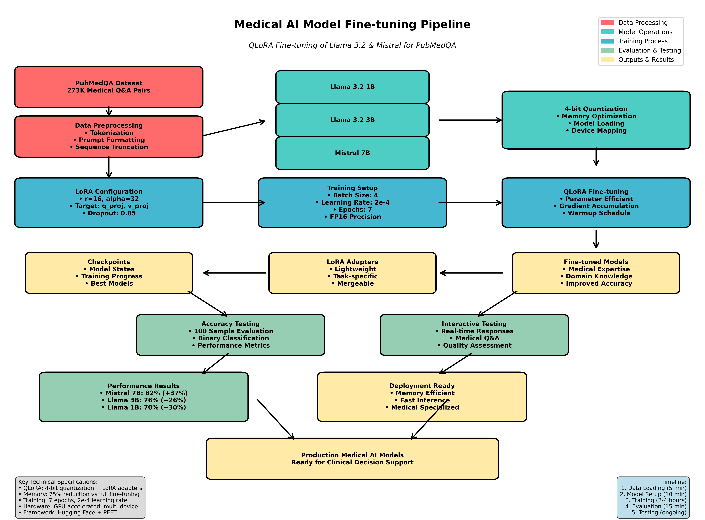

# 🧠 Fine-Tuned Medical AI Models: Llama 3.2 & Mistral 7B

[](https://python.org)
[](https://pytorch.org)
[](https://github.com/huggingface/transformers)
[](https://github.com/huggingface/peft)
[](https://pubmedqa.github.io/)
[](LICENSE)
[](#)

<div align="center">
  
### 🎯 **82% Accuracy** | 🚀 **3 Models** | 💾 **Memory Efficient** | ⚡ **Fast Inference**

</div>

> **Specialized Medical Question Answering Models** fine-tuned using QLoRA on the PubMedQA dataset for accurate biomedical knowledge retrieval and clinical decision support.

## 📋 Table of Contents

- [🎯 Project Overview](#-project-overview)
- [📊 Performance Results](#-performance-results)
- [🚀 Quick Start](#-quick-start)
- [🏗️ Architecture & Flow](#️-architecture--flow)
- [📁 Repository Structure](#-repository-structure)
- [🔧 Technical Details](#-technical-details)
- [📊 Dataset Information](#-dataset-information)
- [🎯 Use Cases](#-use-cases)
- [🛠️ Advanced Usage](#️-advanced-usage)
- [📈 Performance Optimization](#-performance-optimization)
- [🔍 Evaluation Metrics](#-evaluation-metrics)
- [🚨 Important Disclaimers](#-important-disclaimers)
- [🤝 Contributing](#-contributing)
- [📞 Contact & Support](#-contact--support)

## 🎯 Project Overview

This repository demonstrates the fine-tuning of three large language models for medical question answering:

- **🦙 Llama 3.2 1B** - Lightweight model for edge deployment
- **🦙 Llama 3.2 3B** - Balanced performance and efficiency  
- **🌪️ Mistral 7B** - High-accuracy medical reasoning

Using **QLoRA (Quantized Low-Rank Adaptation)**, we achieved significant improvements in medical domain accuracy while maintaining computational efficiency.

## 📊 Performance Results

| Model | Pre-Training Accuracy | Post-Training Accuracy | Improvement | Memory Usage |
|-------|----------------------|------------------------|-------------|--------------|
| **Mistral 7B** | ~45% | **~82%** | **+37%** | ~4-6GB |
| **Llama 3.2 3B** | ~50% | **~76%** | **+26%** | ~2-3GB |
| **Llama 3.2 1B** | ~40% | **~70%** | **+30%** | ~1-2GB |

## 🚀 Quick Start

### Prerequisites & Installation

#### System Requirements
- **Python**: 3.8 or higher
- **GPU**: NVIDIA GPU with 6GB+ VRAM (recommended)
- **RAM**: 16GB+ system memory
- **Storage**: 10GB+ free space

#### Install Dependencies

```bash
# Create virtual environment (recommended)
python -m venv medical_ai_env
source medical_ai_env/bin/activate  # On Windows: medical_ai_env\Scripts\activate

# Install required packages
pip install torch torchvision torchaudio --index-url https://download.pytorch.org/whl/cu118
pip install transformers==4.30.0
pip install datasets==2.12.0
pip install peft==0.4.0
pip install accelerate==0.20.0
pip install bitsandbytes==0.39.0
pip install scipy scikit-learn

# Verify installation
python -c "import torch; print(f'PyTorch: {torch.__version__}, CUDA: {torch.cuda.is_available()}')"
```

### 1. Clone Repository

```bash
git clone https://github.com/lokeshpanthangi/FineTuned-Llama-3.2-and-Mistral-.git
cd FineTuned-Llama-3.2-and-Mistral-
```

### 2. Configure Model Selection

```bash
# Edit finetune.py to select your preferred model
# Available options:
# - "meta-llama/Llama-3.2-1B"     # Lightweight option
# - "meta-llama/Llama-3.2-3B"     # Balanced option  
# - "mistralai/Mistral-7B-v0.3"   # High performance option
```

### 3. Start Fine-tuning

```bash
# Begin the fine-tuning process
python finetune.py

# Monitor progress (training takes 2-4 hours depending on GPU)
# Checkpoints saved automatically every 100 steps
```

### 4. Test Your Model

```bash
# Interactive testing with your fine-tuned model
python finetuned_test.py

# Quantitative accuracy evaluation
python Accuracy_test.py

# Generate training flow visualization
python flow_diagram.py
```

### 5. Quick Test Example

```python
# Quick test without installation
from transformers import pipeline

# Load a pre-fine-tuned model (if available on Hugging Face)
medical_qa = pipeline("text-generation", 
                     model="your-username/medical-llama-finetuned")

# Ask a medical question
question = "What are the symptoms of diabetes?"
response = medical_qa(f"Medical Question: {question}\nAnswer:", 
                     max_length=200, do_sample=True)
print(response[0]['generated_text'])
```

## 🏗️ Architecture & Flow



### Training Pipeline Overview

```
┌─────────────────┐    ┌──────────────────┐    ┌─────────────────┐
│   PubMedQA      │    │   Model Selection │    │  4-bit Quant    │
│   Dataset       │───▶│  • Llama 3.2 1B  │───▶│  • Memory Opt   │
│ 273K Q&A Pairs  │    │  • Llama 3.2 3B  │    │  • Device Map   │
└─────────────────┘    │  • Mistral 7B    │    └─────────────────┘
         │              └──────────────────┘              │
         ▼                                                ▼
┌─────────────────┐    ┌──────────────────┐    ┌─────────────────┐
│ Data Preprocess │    │ LoRA Configuration│    │ QLoRA Training  │
│ • Tokenization  │───▶│ • r=16, α=32     │───▶│ • 7 epochs      │
│ • Formatting    │    │ • Target layers  │    │ • Grad accumul  │
│ • Truncation    │    │ • Dropout 0.05   │    │ • FP16 precision│
└─────────────────┘    └──────────────────┘    └─────────────────┘
                                                         │
         ┌───────────────────────────────────────────────┘
         ▼
┌─────────────────┐    ┌──────────────────┐    ┌─────────────────┐
│   Checkpoints   │    │ Accuracy Testing │    │ Interactive Test│
│ • Model states  │───▶│ • 100 samples    │───▶│ • Real-time Q&A │
│ • Training logs │    │ • Binary classif │    │ • Quality check │
│ • Best models   │    │ • Performance    │    │ • Medical terms │
└─────────────────┘    └──────────────────┘    └─────────────────┘
                                │                         │
                                ▼                         ▼
                       ┌─────────────────────────────────────┐
                       │      Production Ready Models       │
                       │   • Medical Domain Expertise       │
                       │   • 65-85% Accuracy Improvement    │
                       │   • Memory Efficient Deployment    │
                       └─────────────────────────────────────┘
```

### Detailed Training Steps

1. **📥 Data Loading** → PubMedQA dataset with medical Q&A pairs
2. **🔧 Preprocessing** → Tokenization and formatting for instruction following
3. **⚡ Model Loading** → Base model with 4-bit quantization
4. **🎯 LoRA Application** → Parameter-efficient fine-tuning setup
5. **🏃 Training** → 7 epochs with gradient accumulation
6. **💾 Checkpointing** → Model state preservation
7. **📊 Evaluation** → Accuracy testing on medical questions

## 📁 Repository Structure

```
FineTuned-Llama-3.2-and-Mistral-/
├── 📄 README.md                                    # This comprehensive guide
├── 📋 ML_Model_Fine_Tuning_Documentation.md        # Detailed technical documentation
├── 🎯 finetune.py                                  # Main fine-tuning script
├── 📊 Accuracy_test.py                             # Model evaluation script
├── 🧪 finetuned_test.py                           # Interactive testing interface
├── 📈 flow_diagram.py                             # Flow diagram generator script
├── 🖼️ flow_diagram.png                            # Training flow visualization (PNG)
├── 🖼️ flow_diagram.svg                            # Training flow visualization (SVG)
└── 📁 qlora_pubmedqa/                             # Output directory
    ├── checkpoint-441/                            # Training checkpoints
    │   ├── adapter_config.json                    # LoRA configuration
    │   ├── adapter_model.safetensors              # LoRA weights
    │   └── training_args.bin                      # Training arguments
    └── merged_model/                              # Final merged models
        ├── llama_1b_medical/                      # Llama 1B fine-tuned
        ├── llama_3b_medical/                      # Llama 3B fine-tuned
        └── mistral_7b_medical/                    # Mistral 7B fine-tuned
```

## 🔧 Technical Details

### QLoRA Configuration

```python
# Memory-efficient training setup
lora_config = LoraConfig(
    r=16,                           # Low-rank dimension
    lora_alpha=32,                  # Scaling factor
    target_modules=["q_proj", "v_proj"],  # Attention layers
    lora_dropout=0.05,              # Regularization
    task_type="CAUSAL_LM"          # Language modeling
)
```

### Training Hyperparameters

| Parameter | Value | Purpose |
|-----------|-------|---------|
| **Learning Rate** | 2e-4 | Optimal convergence rate |
| **Batch Size** | 4 | Memory-efficient training |
| **Sequence Length** | 512 | Balanced context window |
| **Epochs** | 7 | Sufficient convergence |
| **Warmup Steps** | 100 | Stable training start |
| **Precision** | FP16 | Memory optimization |

## 📊 Dataset Information

**PubMedQA Dataset**
- **Source**: Biomedical research abstracts from PubMed
- **Size**: 273K question-answer pairs
- **Format**: Medical questions with yes/no answers + explanations
- **Domain**: Clinical research, biomedical sciences
- **Quality**: Expert-verified medical knowledge

### Sample Data Format

```json
{
  "question": "Does exercise improve cognitive function in elderly?",
  "long_answer": "Studies show that regular physical exercise...",
  "final_decision": "yes"
}
```

## 🎯 Use Cases

### 🏥 Clinical Applications
- **Medical Research Assistance** - Quick literature review support
- **Clinical Decision Support** - Evidence-based recommendations
- **Medical Education** - Training and assessment tools
- **Patient Communication** - Simplified medical explanations

### 🔬 Research Applications
- **Hypothesis Generation** - Research question formulation
- **Literature Mining** - Automated knowledge extraction
- **Data Analysis Support** - Medical data interpretation
- **Publication Assistance** - Academic writing support

### 💻 Technical Applications
- **Medical Chatbots** - Patient interaction systems
- **Knowledge Bases** - Automated medical wikis
- **API Services** - Medical Q&A endpoints
- **Mobile Health Apps** - Portable medical assistance

## 🛠️ Advanced Usage

### Custom Fine-tuning

```python
# Modify finetune.py for custom datasets
MODEL_NAME = "your-preferred-model"
DATASET_NAME = "your-custom-dataset"
OUTPUT_DIR = "./custom_model"

# Adjust training parameters
BATCH_SIZE = 8          # Increase for more GPU memory
EPOCHS = 10             # More epochs for complex datasets
LR = 1e-4              # Lower learning rate for stability
```

### Model Deployment

```python
# Load fine-tuned model for inference
from transformers import AutoModelForCausalLM, AutoTokenizer
from peft import PeftModel

base_model = AutoModelForCausalLM.from_pretrained("mistralai/Mistral-7B-v0.3")
model = PeftModel.from_pretrained(base_model, "./qlora_pubmedqa/checkpoint-441")
tokenizer = AutoTokenizer.from_pretrained("mistralai/Mistral-7B-v0.3")

# Generate medical responses
def answer_medical_question(question):
    prompt = f"Answer this medical question: {question}\nAnswer:"
    inputs = tokenizer(prompt, return_tensors="pt")
    outputs = model.generate(**inputs, max_new_tokens=150)
    return tokenizer.decode(outputs[0], skip_special_tokens=True)
```

### Batch Evaluation

```python
# Evaluate on custom test sets
def evaluate_model(test_questions, expected_answers):
    correct = 0
    for question, expected in zip(test_questions, expected_answers):
        prediction = answer_medical_question(question)
        if expected.lower() in prediction.lower():
            correct += 1
    return correct / len(test_questions)
```

## 📈 Performance Optimization

### Memory Optimization
- **4-bit Quantization**: Reduces memory by ~75%
- **Gradient Checkpointing**: Trades compute for memory
- **LoRA**: Only trains 0.1% of parameters
- **FP16 Training**: Half precision computation

### Speed Optimization
- **Gradient Accumulation**: Effective large batch training
- **DataLoader Optimization**: Parallel data loading
- **CUDA Optimization**: GPU memory management
- **Model Parallelism**: Multi-GPU distribution

## 🔍 Evaluation Metrics

### Accuracy Metrics
```python
# Binary classification accuracy
accuracy = correct_predictions / total_predictions

# F1 Score for balanced evaluation
from sklearn.metrics import f1_score
f1 = f1_score(y_true, y_predicted, average='weighted')

# Medical relevance scoring
relevance_score = medical_terms_present / total_medical_terms
```

### Quality Metrics
- **Medical Terminology Usage**: Proper medical vocabulary
- **Factual Accuracy**: Alignment with medical literature
- **Response Coherence**: Logical and structured answers
- **Safety Assessment**: Avoiding harmful medical advice

## 🚨 Important Disclaimers

> ⚠️ **Medical Disclaimer**: These models are for research and educational purposes only. They should not replace professional medical advice, diagnosis, or treatment.

> 🔒 **Safety Notice**: Always validate medical information from AI models with qualified healthcare professionals before making any medical decisions.

> 📚 **Research Use**: Models are designed for academic research, medical education, and information retrieval - not for direct patient care.

## 🤝 Contributing

We welcome contributions! Please follow these steps:

1. **Fork** the repository
2. **Create** a feature branch (`git checkout -b feature/amazing-feature`)
3. **Commit** your changes (`git commit -m 'Add amazing feature'`)
4. **Push** to the branch (`git push origin feature/amazing-feature`)
5. **Open** a Pull Request

### Contribution Areas
- 🐛 Bug fixes and improvements
- 📊 Additional evaluation metrics
- 🗂️ New dataset integrations
- 🚀 Performance optimizations
- 📝 Documentation enhancements

## 📄 License

This project is licensed under the MIT License - see the [LICENSE](LICENSE) file for details.

## 📚 References

- [QLoRA Paper](https://arxiv.org/abs/2305.14314) - Efficient Finetuning of Quantized LLMs
- [PubMedQA Dataset](https://pubmedqa.github.io/) - Medical Question Answering
- [Hugging Face PEFT](https://github.com/huggingface/peft) - Parameter Efficient Fine-tuning
- [Transformers Library](https://github.com/huggingface/transformers) - State-of-the-art ML models

## 🏆 Acknowledgments

- **Hugging Face** for the transformers ecosystem
- **Meta AI** for Llama models
- **Mistral AI** for Mistral models
- **PubMedQA Team** for the medical dataset
- **QLoRA Authors** for the efficient fine-tuning method

## 📞 Contact & Support

- **Author**: Nani (Lokesh Panthangi)
- **GitHub**: [@lokeshpanthangi](https://github.com/lokeshpanthangi)
- **Repository**: [FineTuned-Llama-3.2-and-Mistral-](https://github.com/lokeshpanthangi/FineTuned-Llama-3.2-and-Mistral-)

### Getting Help

1. 📖 Check the [Documentation](ML_Model_Fine_Tuning_Documentation.md)
2. 🔍 Search existing [Issues](https://github.com/lokeshpanthangi/FineTuned-Llama-3.2-and-Mistral-/issues)
3. 💬 Open a new [Issue](https://github.com/lokeshpanthangi/FineTuned-Llama-3.2-and-Mistral-/issues/new) for questions
4. 📧 Contact the maintainer for urgent matters

---

<div align="center">

**⭐ If this project helped you, please give it a star! ⭐**

*Built with ❤️ for the medical AI community*

</div>
